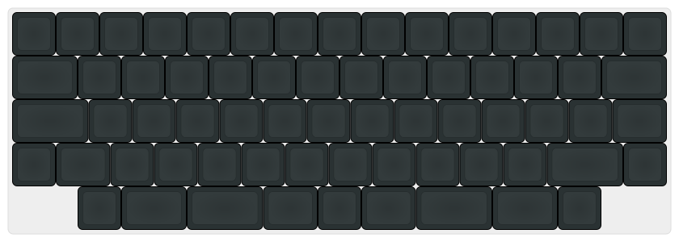
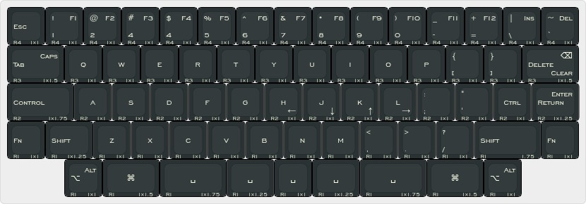

# Syzygia

Syzygia is mechanical keyboard. No keycap stabilizer required.

## Hardware

## Keyboard Layout

### Keyboard Feature

- Display
- Sound
- Encoders
- LED Indicators

### Keyboard Hardware

- PCB
- RP2040
- Raspberry Pi Pico

### Keyboard Case

- 3D print case and/or sandwich case

#### Plate

- Aluminum Plate

### Keyboard Keycaps

- With XDA or DSA profile.

|Size (u)|Qty|
|--------|---|
|1u      |54 |
|1.25u   |4  |
|1.5u    |4  |
|1.75u   |4  |
|Total   |66 |

### Keyboard Firmware

- QMK
- KMK
- ZMK
- Others

